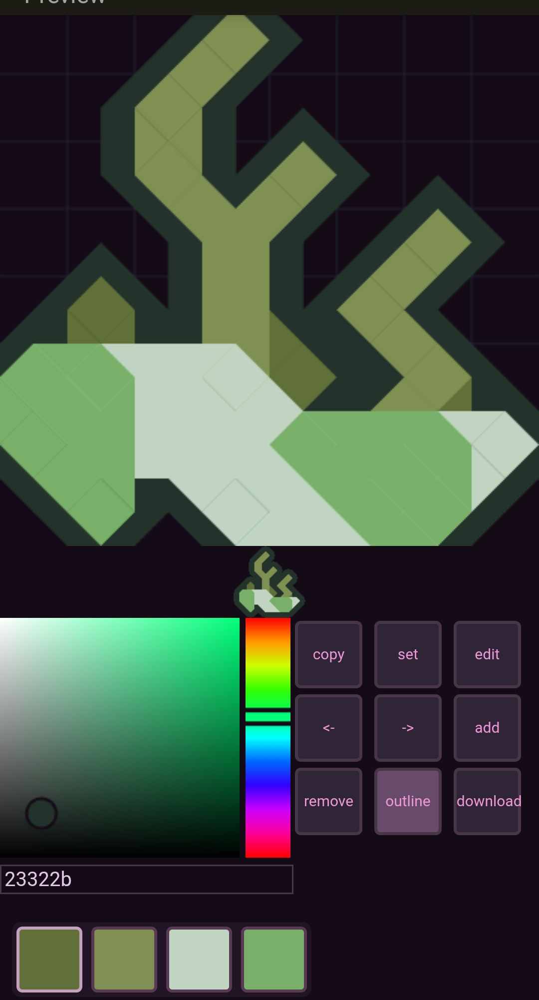

Page: https://namakayo.github.io/Namina/

# Namina
Inspired by <a href="https://github.com/Anuken/Lamina">Anuken/Lamina</>

Draw marching squares in a 8x8 grid
Namina outputs a pixelated 64x64 sprite of what you've drawn. The actual .png file is 76x76.

im writing the documentation right now, wait